# AgenticCoder Orchestration System - Visual Explanations (Mermaid Diagrams)

**Purpose**: Copy-paste ready diagrams for Miro board visualization  
**Format**: Mermaid syntax  
**Total Diagrams**: 12 comprehensive visualizations

---

## 📊 Diagram 1: Complete System Architecture (End-to-End Flow)

```mermaid
graph TD
    INPUT["📋 INPUT: @plan Specification"]
    
    INPUT -->|Tasks, Dependencies, Config| TEE["🔧 System 1: Task Extraction Engine<br/>Extract & Schedule Tasks"]
    
    TEE -->|15 Tasks + Execution Schedule| OE["⚙️ System 2: Orchestration Engine<br/>Execute 15 Phases"]
    
    OE -->|Task Outputs| VF["✅ System 3: Validation Framework<br/>6 Quality Gates"]
    
    VF -->|Validated Results| EB["🚀 System 4: Execution Bridge<br/>Run via 4 Transports"]
    
    EB -->|Generated Bicep Code| BAR["🔄 System 5: Bicep AVM Resolver<br/>Transform to AVM Modules"]
    
    BAR -->|Optimized Templates| FLS["📢 System 6: Feedback Loop System<br/>Report & Remediate"]
    
    FLS -->|Status, Metrics, Notifications| OUTPUT["📤 OUTPUT: Updated @plan<br/>+ Notifications + Metrics"]
    
    OUTPUT -.->|Feedback Loop| INPUT
    
    style INPUT fill:#e1f5ff
    style TEE fill:#fff3e0
    style OE fill:#f3e5f5
    style VF fill:#e8f5e9
    style EB fill:#fce4ec
    style BAR fill:#ede7f6
    style FLS fill:#e0f2f1
    style OUTPUT fill:#c8e6c9
```

---

## 📊 Diagram 2: Task Extraction Engine (TEE) Architecture

```mermaid
graph TD
    PLAN["@plan Specification"]
    
    PLAN -->|Parse| SP["📄 Spec Parser<br/>Tokenize & Extract"]
    
    SP -->|Task List| DR["🔗 Dependency Resolver<br/>Graph Analysis"]
    
    DR -->|Dependencies| CA["📊 Complexity Analyzer<br/>Score Tasks 0-100"]
    
    CA -->|Complexity Data| SG["📅 Schedule Generator<br/>Create 15 Phases"]
    
    SG -->|Phase Schedule| VAL["✓ Validator<br/>Pre-Check Tasks"]
    
    VAL -->|15 Executable Tasks| OE["→ To Orchestration Engine"]
    
    style PLAN fill:#e1f5ff
    style SP fill:#fff3e0
    style DR fill:#fff3e0
    style CA fill:#fff3e0
    style SG fill:#fff3e0
    style VAL fill:#fff3e0
    style OE fill:#c8e6c9
```

---

## 📊 Diagram 3: Orchestration Engine (OE) - 15 Phase Execution

---

## 📊 Diagram 4: Validation Framework (VF) - 6 Gates Sequential Flow

```mermaid
graph TD
    INPUT["Task Output"]
    
    INPUT -->|Gate 1| SCHEMA["🔍 Schema Validator<br/>JSON Schema Check"]
    
    SCHEMA -->|PASS| SYNTAX["🔍 Syntax Validator<br/>Bicep/ARM Syntax"]
    
    SYNTAX -->|PASS| DEPENDENCY["🔍 Dependency Validator<br/>Dependency Correctness"]
    
    DEPENDENCY -->|PASS| SECURITY["🔍 Security Validator<br/>Security Best Practices"]
    
    SECURITY -->|PASS| TESTING["🔍 Testing Validator<br/>Test Execution"]
    
    TESTING -->|PASS| GATEMANAGER["🎯 Gate Manager<br/>Orchestrate Gates"]
    
    GATEMANAGER -->|Score 0-100| OUTPUT["✅ Validated Output<br/>Quality Score"]
    
    SCHEMA -->|FAIL| FAIL["❌ Validation Failed<br/>Return to Agent"]
    SYNTAX -->|FAIL| FAIL
    DEPENDENCY -->|FAIL| FAIL
    SECURITY -->|FAIL| FAIL
    TESTING -->|FAIL| FAIL
    
    style SCHEMA fill:#c8e6c9
    style SYNTAX fill:#c8e6c9
    style DEPENDENCY fill:#c8e6c9
    style SECURITY fill:#c8e6c9
    style TESTING fill:#c8e6c9
    style GATEMANAGER fill:#81c784
    style OUTPUT fill:#2e7d32
    style FAIL fill:#ef5350
```

---

## 📊 Diagram 5: Execution Bridge (EB) - 4 Transport Methods

```mermaid
graph TD
    VALIDATED["Validated Command"]
    
    VALIDATED --> TS["🔀 Transport Selector<br/>Choose Transport"]
    
    TS -->|Route 1| WEBHOOK["🌐 Webhook<br/>HTTP POST<br/>Fastest"]
    TS -->|Route 2| PROCESS["⚙️ Process<br/>Local Subprocess<br/>Very Fast"]
    TS -->|Route 3| DOCKER["🐳 Docker<br/>Container Execution<br/>Isolated"]
    TS -->|Route 4| API["🔌 API<br/>REST Call<br/>Flexible"]
    
    WEBHOOK --> EC["🔧 Execution Context<br/>Setup Environment"]
    PROCESS --> EC
    DOCKER --> EC
    API --> EC
    
    EC --> AI["🤖 Agent Invoker<br/>Execute Command"]
    
    AI --> OC["📊 Output Collector<br/>Capture Output"]
    
    OC --> LM["📋 Lifecycle Manager<br/>Track Execution"]
    
    LM --> RH["✓ Result Handler<br/>Process Results"]
    
    RH --> OUT["📤 Execution Results"]
    
    style WEBHOOK fill:#bbdefb
    style PROCESS fill:#bbdefb
    style DOCKER fill:#bbdefb
    style API fill:#bbdefb
    style EC fill:#64b5f6
    style AI fill:#42a5f5
    style OC fill:#2196f3
    style LM fill:#1e88e5
    style RH fill:#1565c0
    style OUT fill:#0d47a1
```

---

## 📊 Diagram 6: Bicep AVM Resolver (BAR) - Transformation Pipeline

```mermaid
graph TD
    BICEP["Generated Bicep Code"]
    
    BICEP --> RA["🔍 Resource Analyzer<br/>Parse Bicep<br/>Identify Resources"]
    
    RA --> MM["🗺️ Module Mapper<br/>Match to AVM<br/>150+ Modules"]
    
    MM --> TT["🔄 Template Transformer<br/>Rewrite Template<br/>Replace Resources"]
    
    TT --> VE["✅ Validation Engine<br/>Equivalence Check<br/>Syntax Validation"]
    
    VE -->|Valid| OE["⚡ Optimization Engine<br/>Cost & Security<br/>Best Practices"]
    
    VE -->|Invalid| BACK["↩️ Rework"]
    
    OE --> OUT["📤 AVM Template<br/>15-30% Cost Savings"]
    
    style BICEP fill:#f3e5f5
    style RA fill:#e1bee7
    style MM fill:#ce93d8
    style TT fill:#ba68c8
    style VE fill:#ab47bc
    style OE fill:#8e24aa
    style OUT fill:#4a148c
    style BACK fill:#ef5350
```

---

## 📊 Diagram 7: Feedback Loop System (FLS) - Components & Data Flow

```mermaid
graph TD
    EXEC["Execution Results<br/>from EB, BAR, VF"]
    
    EXEC --> SU["📍 Status Updater<br/>Real-time Progress<br/>State Machine"]
    
    EXEC --> MC["📊 Metrics Collector<br/>Performance Data<br/>Cost Metrics"]
    
    EXEC --> RA["📦 Result Aggregator<br/>Consolidate Outputs<br/>Deduplication"]
    
    SU --> PU["✏️ Plan Updater<br/>Write to @plan<br/>Preserve Original"]
    
    MC --> NS["📢 Notification System<br/>Multi-Channel Alerts<br/>Email/Slack/Teams"]
    
    RA --> DE["🤖 Decision Engine<br/>Error Analysis<br/>Auto Remediation"]
    
    PU --> OUT["📤 Updated @plan<br/>+ Notifications<br/>+ Metrics"]
    
    NS --> OUT
    
    DE --> OUT
    
    OUT -.->|Feedback| EXEC
    
    style SU fill:#b2dfdb
    style MC fill:#80cbc4
    style RA fill:#4db6ac
    style PU fill:#26a69a
    style NS fill:#009688
    style DE fill:#00897b
    style OUT fill:#00695c
```

---

## 📊 Diagram 8: Data Structure Flow - Task through System

---

## 📊 Diagram 9: System Component Dependencies & Integration Points

---

## 📊 Diagram 10: Execution Bridge - 4 Transport Methods Comparison

```mermaid
graph TD
    DECISION{"Transport<br/>Selection"}
    
    DECISION -->|HTTP Ready| WEBHOOK["<b>🌐 Webhook</b><br/>Speed: ⚡⚡⚡⚡⚡<br/>Latency: ~100ms<br/>Isolation: Low<br/>Best for: Cloud Services<br/>Example: Azure Functions"]
    
    DECISION -->|Local Command| PROCESS["<b>⚙️ Process</b><br/>Speed: ⚡⚡⚡⚡<br/>Latency: ~50ms<br/>Isolation: Medium<br/>Best for: Same-Machine<br/>Example: PowerShell Script"]
    
    DECISION -->|Need Isolation| DOCKER["<b>🐳 Docker</b><br/>Speed: ⚡⚡⚡<br/>Latency: ~500ms<br/>Isolation: High<br/>Best for: Complex Setup<br/>Example: Multi-container"]
    
    DECISION -->|REST API| API["<b>🔌 API</b><br/>Speed: ⚡⚡<br/>Latency: ~200ms<br/>Isolation: Medium<br/>Best for: Third-party<br/>Example: External API"]
    
    style WEBHOOK fill:#bbdefb
    style PROCESS fill:#c8e6c9
    style DOCKER fill:#ffe0b2
    style API fill:#f8bbd0
```

---

## 📊 Diagram 11: Task State Machine - Execution Lifecycle

---

## 📊 Diagram 12: Bicep AVM Resolver - Transformation Example

```mermaid
graph TD
    subgraph "BEFORE: Custom Bicep"
        B1["resource storageAccount<br/>Microsoft.Storage/storageAccounts<br/>{<br/>  name, location, kind,<br/>  sku, properties...<br/>}"]
    end
    
    subgraph "ANALYSIS"
        A1["Resource Type:<br/>Storage Account<br/><br/>Properties:<br/>- StorageV2<br/>- Hot tier<br/>- HTTPS only<br/>- TLS 1.2"]
    end
    
    subgraph "MAPPING"
        M1["AVM Module Match:<br/>avm/storage/storage-account<br/><br/>Parameter Mapping:<br/>- location → location<br/>- name → name<br/>- kind → kind<br/>- sku → storageAccountType"]
    end
    
    subgraph "AFTER: AVM Module"
        A2["module storageAccount<br/>  'avm/storage/<br/>storage-account:0.13.0' = {<br/>  name: storageName<br/>  location: location<br/>  storageSku: 'Premium_LRS'<br/>}"]
    end
    
    B1 --> A1 --> M1 --> A2
    
    style B1 fill:#ffcccc
    style A1 fill:#fff9c4
    style M1 fill:#c8e6c9
    style A2 fill:#c8e6c9
```

---

## 🎯 How to Use These Diagrams in Miro

### **Option 1: Copy Individual Diagrams**
1. Copy the Mermaid code block (the text between the triple backticks)
2. Open your Miro board
3. Click **"Text"** tool → **"Code Snippet"** or **"Embed"**
4. Paste the Mermaid syntax
5. Miro will render it automatically (if Mermaid is enabled)

### **Option 2: Add as Code Blocks**
1. Create a text block in Miro
2. Copy the diagram title + the code
3. Format as a code block for reference

### **Option 3: Create Shapes Manually**
Use these diagrams as reference to draw in Miro using:
- **Shapes**: Rectangles for components, diamonds for decisions
- **Connectors**: Arrows showing data flow
- **Groups**: Cluster related components
- **Colors**: Use consistent colors per system (see style definitions)

### **Option 4: Export to Mermaid Live**
1. Go to https://mermaid.live
2. Paste any diagram code
3. Render and export as image
4. Import image to Miro

---

## 📐 Color Scheme Guide

| System | Color Code | Hex | Usage |
|--------|-----------|-----|-------|
| TEE (Task Extraction) | Light Orange | #fff3e0 | Input/Parsing components |
| OE (Orchestration) | Light Purple | #f3e5f5 | Orchestration/Flow components |
| VF (Validation) | Light Green | #e8f5e9 | Quality/Validation gates |
| EB (Execution Bridge) | Light Pink | #fce4ec | Execution/Transport components |
| BAR (Bicep AVM) | Light Indigo | #ede7f6 | Transformation components |
| FLS (Feedback Loop) | Light Teal | #e0f2f1 | Feedback/Reporting components |

---

## 🔑 Key Concepts Visualized

### **1. End-to-End Flow (Diagram 1)**
Shows how data flows from @plan specification through all 6 systems to produce updated @plan with results.

### **2. 15-Phase Execution (Diagram 3)**
Illustrates how the system executes tasks in 15 sequential phases, each building on the previous.

### **3. Quality Gates (Diagram 4)**
Shows the 6 sequential validation gates that every output must pass before proceeding.

### **4. Transport Selection (Diagram 10)**
Demonstrates how different transports are chosen based on execution context:
- Webhook: Fastest, cloud-native
- Process: Very fast, same-machine
- Docker: Isolated, complex setups
- API: Flexible, third-party integrations

### **5. State Machine (Diagram 11)**
Shows the complete lifecycle of a task from creation through completion, including error handling and escalation.

### **6. Component Dependencies (Diagram 9)**
Visual representation of how systems depend on and communicate with each other.

---

## 💡 Tips for Miro Visualization

1. **Use Frames** to group diagrams by system:
   - Frame 1: System 1 (TEE)
   - Frame 2: System 2 (OE)
   - Frame 3: System 3 (VF)
   - Frame 4: System 4 (EB)
   - Frame 5: System 5 (BAR)
   - Frame 6: System 6 (FLS)

2. **Add Annotations** explaining:
   - What each component does
   - Key algorithms used
   - Integration points
   - Data formats

3. **Link to Specs** from diagrams:
   - Each diagram can link to detailed specification files
   - Create a legend mapping diagram components to spec files

4. **Use Swimlanes** for phase execution:
   - Show which agents run in each phase
   - Show dependencies between phases
   - Track state transitions

---

## 📚 Related Documentation

- **ARCHITECTURE_SUMMARY.md** - Complete written overview
- **INDEX.md** - Navigation guide to all specifications
- **System READMEs**:
  - TaskExtractionEngine/README.md
  - OrchestrationEngine/README.md
  - ValidationFramework/README.md
  - ExecutionBridge/README.md
  - BicepAVMResolver/README.md
  - FeedbackLoop/README.md

---

**Total Diagrams**: 12 comprehensive visualizations  
**Total Lines**: 400+ lines of Mermaid syntax  
**Use Case**: Copy-paste directly into Miro or mermaid.live  
**Last Updated**: January 13, 2026
