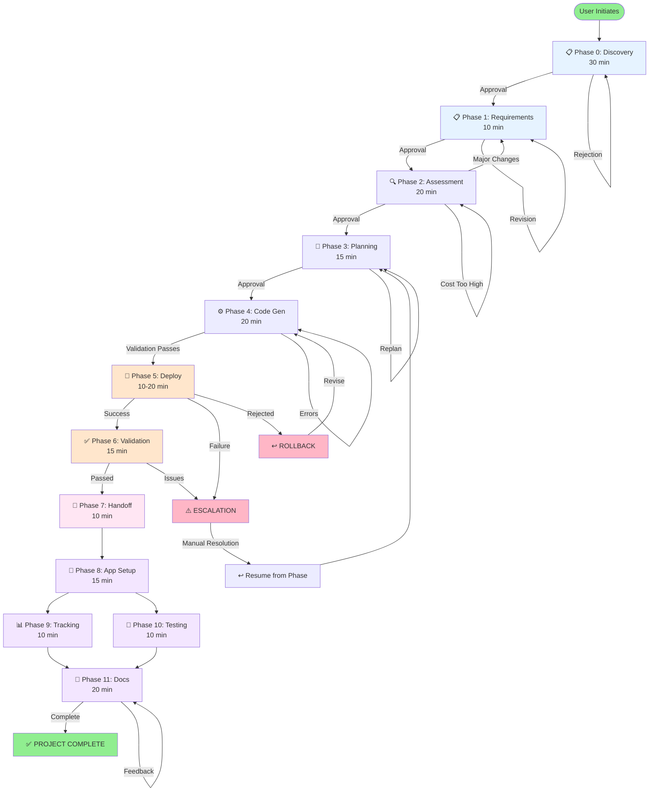

# Unified Workflow - Visual Guides

## State Machine Diagram (Mermaid)



## Timeline Visualization

```
PHASE TIMELINE (Typical Project)
═══════════════════════════════════════════════════════════════════

 0 min ├─ Phase 0: Discovery & Planning ─┤ 30 min
       │  • 22 adaptive questions
       │  • ProjectPlan generation (50+ docs)
       │  • Agent team configuration

30 min ├─ Phase 1: Requirements ─┤ 40 min
       │  • User provides infra requirements
       │  • 01-requirements.md created
       │  • User approval

40 min ├─ Phase 2: Assessment ──────┤ 60 min
       │  • WAF assessment
       │  • Cost estimation
       │  • Architecture diagrams (optional)

60 min ├─ Phase 3: Planning ────┤ 75 min
       │  • Implementation planning
       │  • Governance discovery
       │  • Phased cost estimates

75 min ├─ Phase 4: Code Gen ──────────┤ 95 min
       │  • Bicep template generation
       │  • Validation gates
       │  • Security scanning

95 min ├─ Phase 5: Deployment ────────┤ 115 min
       │  • What-if analysis
       │  • Azure deployment
       │  • Resource inventory

115 min ├─ Phase 6: Validation ──────┤ 130 min
        │  • Resource validation
        │  • Cost realization
        │  • Optimization analysis

130 min ├─ Phase 7: Handoff ─────┤ 140 min
        │  • Connection strings
        │  • Environment configs
        │  • Team notification

140 min ├─ Phase 8: App Setup ──────┤ 155 min
        │  • Code scaffolding
        │  • CI/CD baseline
        │  • Project structure

155 min ├─ Phase 9: Tracking ─┤ 165 min    ┬─ Both run in parallel
        │  • Dashboards setup         │
        │  • Risk tracking            │
        │                             │
155 min ├─ Phase 10: Testing ─┤ 165 min   ┤
        │  • Test frameworks          │
        │  • Code coverage setup      ┘

165 min ├─ Phase 11: Documentation ────┤ 185 min
        │  • API documentation
        │  • Deployment guides
        │  • Training materials

185 min └─ PROJECT COMPLETE ───→
```

## Phase Grouping by Focus Area

```
┌─────────────────────────────────────────────────────────────────┐
│           INFRASTRUCTURE AUTOMATION PIPELINE                     │
│              (Phases 1-7: 100 minutes)                          │
├─────────────────────────────────────────────────────────────────┤
│                                                                   │
│  Phase 1: Requirements         Phase 2: Assessment              │
│  ┌──────────────────────┐     ┌──────────────────────┐          │
│  │ • Infrastructure     │ --> │ • WAF assessment     │          │
│  │   requirements       │     │ • Cost estimates     │          │
│  │ • Networking         │     │ • Diagrams           │          │
│  │ • Compliance         │     │ (azure-principal-    │          │
│  │                      │     │  architect)          │          │
│  └──────────────────────┘     └──────────────────────┘          │
│           ↓                                ↓                     │
│  Phase 3: Planning             Phase 4: Code Generation         │
│  ┌──────────────────────┐     ┌──────────────────────┐          │
│  │ • Impl. planning     │ --> │ • Bicep templates    │          │
│  │ • Governance disc.   │     │ • Validation gates   │          │
│  │ • Cost refinement    │     │ • Security scanning  │          │
│  │ (bicep-plan)         │     │ (bicep-implement)    │          │
│  └──────────────────────┘     └──────────────────────┘          │
│           ↓                                ↓                     │
│  Phase 5: Deployment           Phase 6: Validation              │
│  ┌──────────────────────┐     ┌──────────────────────┐          │
│  │ • Azure deployment   │ --> │ • Resource validation│          │
│  │ • What-if analysis   │     │ • Optimization       │          │
│  │ • Resource inventory │     │ • As-built docs      │          │
│  │ (deploy-coordinator) │     │ (doc-generator)      │          │
│  └──────────────────────┘     └──────────────────────┘          │
│           ↓                                ↓                     │
│  Phase 7: Handoff              Application Teams Ready           │
│  ┌──────────────────────┐                                        │
│  │ • Connection strings │                                        │
│  │ • Configs & secrets  │                                        │
│  │ • Team notification  │                                        │
│  │ (impl.-coordinator)  │                                        │
│  └──────────────────────┘                                        │
│           ↓                                                       │
│  APPLICATION READY FOR DEPLOYMENT                               │
│                                                                   │
└─────────────────────────────────────────────────────────────────┘
                              ↓
┌─────────────────────────────────────────────────────────────────┐
│       APPLICATION DEVELOPMENT PIPELINE                          │
│              (Phases 8-11: 55 minutes)                          │
├─────────────────────────────────────────────────────────────────┤
│                                                                   │
│  Phase 0: Discovery            Phase 8: App Setup               │
│  ┌──────────────────────┐     ┌──────────────────────┐          │
│  │ • 22 discovery Q's   │     │ • Code scaffolding   │          │
│  │ • ProjectPlan gen    │ --> │ • CI/CD baseline     │          │
│  │ • Epics/stories      │     │ • Project structure  │          │
│  │ • Timeline/phases    │     │ (impl-coordinator)   │          │
│  └──────────────────────┘     └──────────────────────┘          │
│                                        ↓                        │
│                    ┌─────────────────────────────────┐           │
│                    │                                 │           │
│        Phase 9: Tracking         Phase 10: Testing  │           │
│        ┌──────────────────┐     ┌──────────────────┐│           │
│        │ • Dashboards     │     │ • Test frameworks ││ PARALLEL  │
│        │ • Risk tracking  │     │ • Code coverage   ││           │
│        │ • Reports        │     │ • Security scans  ││           │
│        │ (reporter)       │     │ (qa-validator)    ││           │
│        └──────────────────┘     └──────────────────┘│           │
│                    │                                 │           │
│                    └─────────────────────────────────┘           │
│                              ↓                                   │
│        Phase 11: Documentation                                  │
│        ┌──────────────────────┐                                │
│        │ • API documentation  │                                │
│        │ • Deployment guide   │                                │
│        │ • Training materials │                                │
│        │ (doc-writer)         │                                │
│        └──────────────────────┘                                │
│                    ↓                                            │
│        PROJECT COMPLETE & READY FOR OPS                        │
│                                                                   │
└─────────────────────────────────────────────────────────────────┘
```

## Agent Distribution Across Tiers

```
AGENT ALLOCATION BY TIER
════════════════════════════════════════════════════════════════

┌─ ORCHESTRATION TIER (9 agents) ─────────────────────────────┐
│                                                               │
│  Role: Overall coordination and governance                   │
│                                                               │
│  ┌─ project-plan-generator          Phase 0 (Discovery)     │
│  ├─ doc-writer                      Phases 0, 11             │
│  ├─ backlog-strategist              Phases 0, 9              │
│  ├─ implementation-coordinator      Phases 0, 3, 7, 8, 9     │
│  ├─ qa-validator                    Phases 0, 10             │
│  ├─ reporter                        Phase 9                  │
│  ├─ deploy-coordinator              Phase 5                  │
│  ├─ workload-documentation-gen      Phases 6, 11             │
│  └─ cicd-engineer                   Phase 8                  │
│                                                               │
└───────────────────────────────────────────────────────────────┘

┌─ ARCHITECTURE TIER (8 agents) ──────────────────────────────┐
│                                                               │
│  Role: Infrastructure and solution design                    │
│                                                               │
│  ┌─ azure-principal-architect       Phase 2 (Assessment)    │
│  ├─ bicep-plan                      Phase 3 (Planning)       │
│  ├─ bicep-implement                 Phase 4 (Code Gen)       │
│  ├─ adr-generator                   Phase 2                  │
│  ├─ diagram-generator               Phases 2, 6              │
│  ├─ database-specialist             Phases 2, 3              │
│  ├─ security-architect              Phases 2, 3              │
│  └─ cost-optimizer                  Phases 2, 6              │
│                                                               │
└───────────────────────────────────────────────────────────────┘

┌─ IMPLEMENTATION TIER (18 agents) ──────────────────────────┐
│                                                              │
│  Role: Development, testing, operations                     │
│                                                              │
│  ┌─ frontend-wireframe              Phase 8                 │
│  ├─ backend-developer               Phases 8, 9, 10         │
│  ├─ api-developer                   Phases 8, 9, 10         │
│  ├─ database-developer              Phases 8, 9, 10         │
│  ├─ devops-engineer                 Phases 8, 9, 10         │
│  ├─ security-engineer               Phases 8, 9, 10         │
│  ├─ testing-engineer                Phase 10                │
│  ├─ integration-specialist          Phases 7, 8             │
│  ├─ performance-analyst             Phases 6, 10            │
│  ├─ ui-ux-designer                  Phase 8                 │
│  ├─ documentation-engineer          Phase 11                │
│  ├─ quality-assurance-lead          Phase 10                │
│  ├─ deployment-specialist           Phases 5, 6             │
│  ├─ monitoring-specialist           Phase 6                 │
│  ├─ incident-responder              Phase 9                 │
│  ├─ training-specialist             Phase 11                │
│  ├─ compliance-officer              Phases 3, 10            │
│  └─ project-manager                 Phases 0, 9             │
│                                                              │
└──────────────────────────────────────────────────────────────┘

TOTAL: 35 AGENTS ACROSS 3 TIERS
```

## Artifact Generation Flow

```
PROJECT ARTIFACTS GENERATED BY PHASE
═══════════════════════════════════════════════════════════════════

Phase 0 (Discovery)        Phase 1 (Requirements)      Phase 2 (Assessment)
┌─────────────────┐        ┌──────────────────┐       ┌──────────────┐
│ • README.md     │        │ • 01-requirements │       │ • 02-assess  │
│ • DISCOVERY.md  │  ──>   │                  │  ──>  │ • cost-est   │
│ • REQUIREMENTS  │        │                  │       │ • diagrams   │
│ • CONTEXT       │        │                  │       │ • ADRs       │
│ • BACKLOG.md    │        │                  │       │              │
│ • TIMELINE.md   │        │                  │       │              │
│ • PHASES.md     │        │                  │       │              │
└─────────────────┘        └──────────────────┘       └──────────────┘
        ↓                            ↓                        ↓

Phase 3 (Planning)         Phase 4 (Code Gen)         Phase 5 (Deploy)
┌─────────────────┐        ┌──────────────────┐       ┌──────────────┐
│ • 04-plan.md    │        │ • main.bicep     │       │ • 06-deploy  │
│ • governance    │  ──>   │ • modules/       │  ──>  │ • inventory  │
│ • constraints   │        │ • parameters.json│       │ • outputs    │
│ • cost refined  │        │ • deploy.ps1     │       │ • resources  │
│                 │        │ • 05-reference   │       │              │
└─────────────────┘        └──────────────────┘       └──────────────┘
        ↓                            ↓                        ↓

Phase 6 (Validation)       Phase 7 (Handoff)          Phase 8 (App)
┌─────────────────┐        ┌──────────────────┐       ┌──────────────┐
│ • 07-workload   │        │ • 08-handoff.md  │       │ • src/       │
│ • as-built      │  ──>   │ • .env configs   │  ──>  │ • tests/     │
│ • optimization  │        │ • connection     │       │ • .github/   │
│ • runbooks      │        │ • strings        │       │ • docs/      │
└─────────────────┘        └──────────────────┘       └──────────────┘
        ↓                            ↓                        ↓

Phase 9 (Tracking)         Phase 10 (Testing)         Phase 11 (Docs)
┌─────────────────┐        ┌──────────────────┐       ┌──────────────┐
│ • dashboards    │        │ • test/          │       │ • API.md     │
│ • risk register │  ──>   │ • coverage       │  ──>  │ • deploy.md  │
│ • reports       │        │ • security       │       │ • trouble    │
│ • budget track  │        │ • CI/CD rules    │       │ • knowledge  │
│                 │        │                  │       │ • training   │
└─────────────────┘        └──────────────────┘       └──────────────┘

═════════════════════════════════════════════════════════════════════
RESULT: 50+ PROJECT ARTIFACTS ACROSS 12 PHASES
```

---

**Visual Guide Status**: Complete ✅  
**Integration**: Ready for use with UnifiedWorkflow.js module

